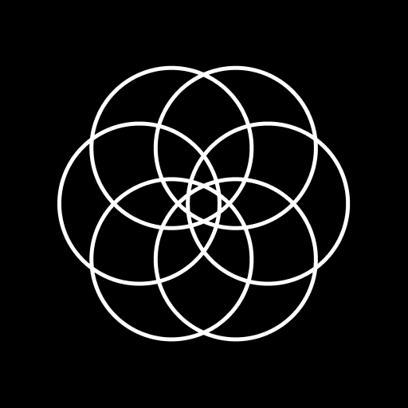

<p align="center">
  <a href="https://mandala.roscoe.dev">
    
  </a>
</p>
<h1 align="center">
  Cats In Cups
</h1>

<div align="center">
  <a href="https://mandala.roscoe.dev/" marginRight="20px">Visit Site</a>
</div>
<br/>

Created as a hackathon entry, Mandala Studio is a tool to create intricate mandala patterns with ease. Drag you finger (or the mouse) on the screen to draw and your pattern will be replicated along multiple lines of symmetry.

## 🚀 Quick start

1.  **Install dependencies**

    ```shell
    yarn
    ```

2.  **Start developing.**

    Navigate into the site’s directory and start it up.

    ```shell
    cd mandala-studio/
    yarn start
    ```

3.  **Open the code and start customizing!**

    The site is now running at http://localhost:4444!
